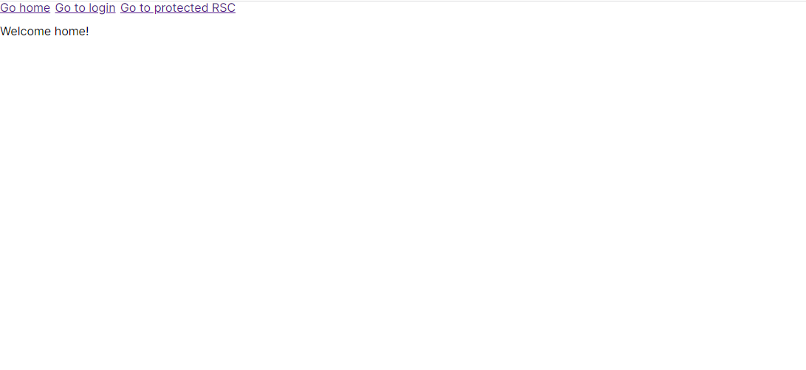
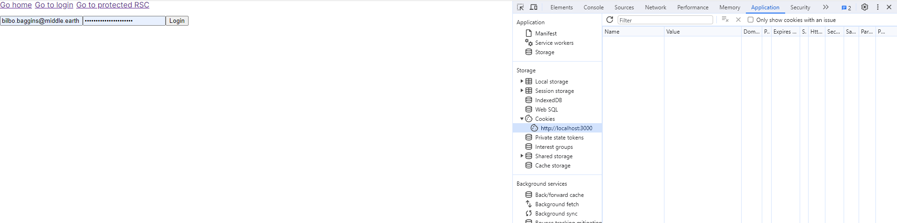
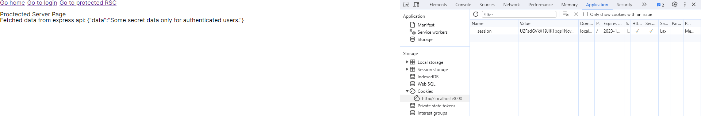
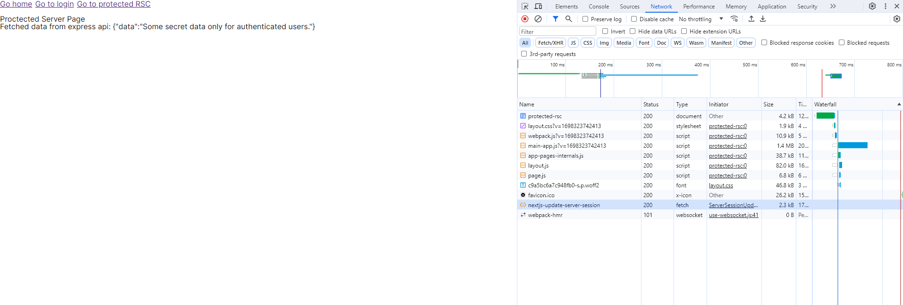
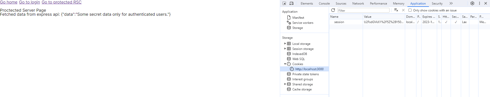

Next.js 13 App Directory RSC Refresh Token Flow

This repository serves as a proof of concept for handling the "traditional SPA" refresh token flow within the new Next.js 13 App Directory's React Server Components. It is also based on my blog post that you can read [here](https://google.com/).

**Note:** This repository is for demonstration purposes only. It contains sensitive information, unsafe variables, and passwords stored directly in the code for convenience and ease of setup. In real-world applications, you should never do this.

## Repository Structure

- `express-api` - A mock API that manages user information and provides functionality for login and token refreshing.
- `nextjs-frontend` - A Next.js 13 App that demonstrates the refresh token flow in React Server Components (RSC) and includes additional helper functions.

## How to Use

### Prerequisites

Before you begin, make sure you have the following software installed on your computer:

- [Node.js v18.14.0](https://nodejs.org/dist/v18.14.0) (which comes with [npm](https://npmjs.com))

### Setting up the Express API

1. Navigate to the `/express-api` folder.
2. Install npm dependencies:
```bash
npm install
```
3. Start the Express API:
```bash
npm run start
```
This will launch the mock API on port 8000.

### Setting up the Next.js Frontend

1. Navigate to the `/nextjs-frontend` folder.
2. Install npm dependencies:
```bash
npm install
```
3. Start the frontend in development mode:
```bash
npm run dev
```
This will run the Next.js app on port 3000.

## Example flow:

1. Open [the frontend](http://localhost:3000) (ensure the mock API is running).



2. Navigate to the login page with your browser's developer tools open. After logging in, you should see a new HTTP-only cookie named `session`. This cookie contains information about tokens & the user, and is encrypted. It will also redirect you to the protected page (`protected-rsc`).




3. If you refresh the page immediately, everything works as usual because the token is still valid (not expired).

4. Wait for a minute (the example's token validity duration) and then refresh the page. You can now open the network tab in the developer tools and see a new request to the `/api/nextjs-update-server-session` endpoint in Next.js. This endpoint updates the `session` cookie with new tokens received from the backend Express API within the RSC. You will notice that the `session` cookie's value has changed.



